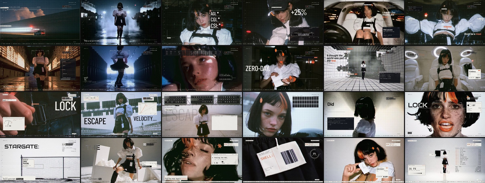
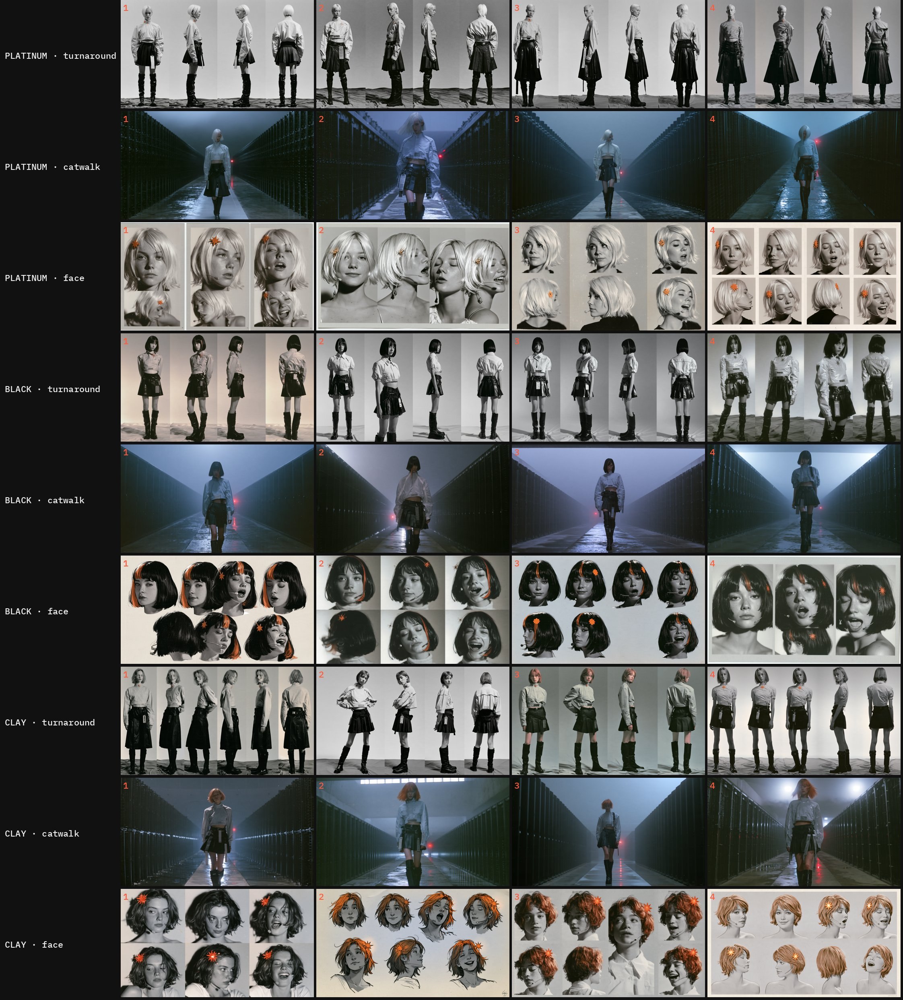
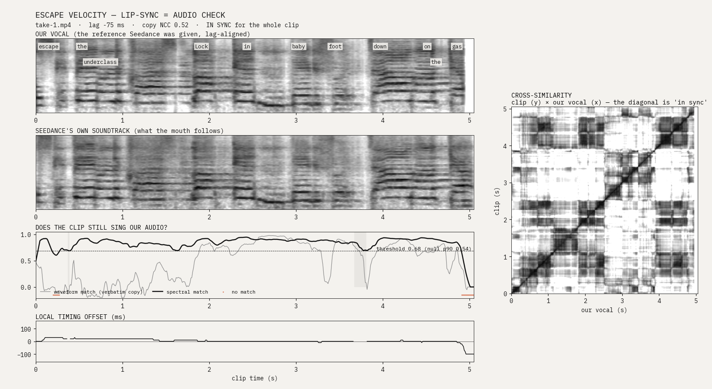

# 拆解《ESCAPE VELOCITY》：它是怎么做出来的，我们能学到什么

来源：<https://github.com/michaelpersonal/anabology-escape-velocity>（anabology 公开的完整制作记录：所有 Midjourney / Seedance / Suno 提示词、导演原话、多智能体工作流脚本，外加 636 张 MJ 原图）。

本文是我们在做完反 EA 偶像 MV、Musk 纪录片之后，回头系统研究这支片子的笔记。前半部分是「它怎么做的」，后半部分是「对我们意味着什么」。

---

## 一、一句话概括

**5 分 06 秒的歌词 MV**：一场科技时装秀，每个 “Look N” 都是一个旧金山科技圈梗，由一个 AI 女模特走秀兼演唱。一块翻牌（split-flap）倒计时 “18 MONTHS TO ESCAPE THE PERMANENT UNDERCLASS” 贯穿全片，最后翻成 “THERE IS NO UNDERCLASS”，T 台起飞进入纯白（white-pill 结局）。

- **约 19 小时**（墙钟时间）从第一条消息到 v2 母版。
- 人类导演 anabology **只发了约 50 条消息**，负责全部审美判断。
- Claude（Claude Code，Opus 5.5 1M 上下文）是整个制作团队：调研、写词、分镜、提示词、剪辑、每一帧动效。
- 工具：Midjourney v8.2（美术）、Suno v6（歌）、Seedance 2.5（运动镜头）、自研 JS 引擎（所有叠加图形）、家用 RTX 3090 Ti（音频分析、深度图、跟踪、补救对口型）。

## 二、关键数字

| 项目 | 数字 |
|---|---|
| 歌曲 | 5:06.4 · Suno v6 · 131.5 → 133.9 BPM（会加速，所以永远用 beat map，不用固定 BPM） |
| 剪辑 | 141 个镜头 · 9 个章节 · 每个词按对齐时间上屏 |
| Midjourney | 188 条提示词 · 15 批 · 636 张图 · 用上 130 张 plate |
| Seedance 2.5 | 47 个分镜 clip + 30 个续接 cover · 91 次提交 · 421 秒 720p · 约 $93 |
| Claude | 14 亿 token · API 价约 $626（Max 订阅内跑） |
| 渲染 | 7,354 帧 1080p · 4 核约 63 分钟 · CRF 16 |

**Token 花在哪**：动画（每章 animator + 美术指导 + fixer）$301（48%）> 主会话 $185（30%）> 分镜 $95（15%）> 调研写词 $44（7%）。96% 的 token 是缓存重读；看图只占不到 4%。
→ **结论：钱主要花在「动效反复渲染-看图-修」这个环节，这也正是片子质量的来源。**

## 三、制作流程（按顺序）

### 1. 起点：一个「一条提示词」的参考片
anabology 看到 @donaldjewkes 的 P(doom) 偶像 MV（一条超长 Claude 提示词做出来的），把那条提示词贴给 Claude，说：「我要做我自己的版本，换风格、按我在 design-ref 里记录和排序过的品味来」。

原提示词里最值得记住的几条思路：
- 视频生成只是**底座**；真正的作品是 JS 在上面「描」出来的一层（类似 rotoscope）。
- 歌词动效是留住注意力的核心；构图时就要给歌词**预留空白区**（人物在右，字在左）。
- 字幕大小要有变化：开头 hook 处字要大、要抢眼。
- 把歌切片作为 Seedance 的音频参考，**建立验证回路**确认对口型。
- 反复看整片、截图、自问「够不够格」，愿意返工。

### 2. 调研 + 写词（多智能体工作流，约 31 个 agent）
- 5 路并行调研：近 8 周 AI 大事、2026 长寿新闻、SF 梗（深挖、去重）、时间线金句（只要原话）、旧歌词事实核查。每条带 `recognisability 1–5`、`lyric_hook`、`visual`、`confidence`、`risk`。
- **对抗式核查**：每 10 条一批，verifier 的任务是「试图证伪」，找不到独立来源就判 unverifiable；未核实的不准进歌词。
- 4 个写词角度并行：**密度 / 张力 / hook / 时装秀格式**。
- 3 个评委视角打分：SF 科技推特重度用户、流行词曲作者、无情编辑。
- head writer 以最高分稿为底、嫁接各稿最佳句、删掉所有最差句；最后 critic 数音节（128 BPM 下每小节 6–10 个音节）并直接改文件。

### 3. 歌（Suno v6）
- **主歌是冷面念白（deadpan spoken word）**：每一句都能塞一个梗，不用迁就旋律。**副歌是欣快的 trance 唱段**，承担情绪转折（“(It's so over?) WE'RE SO BACK!”）。
- 数字、缩写在歌词里拼开写（“A G I”、“eighteen”），保证发音。
- 押韵围绕一个锚点短语组织梗（从 P(doom) 学来的手法）。
- 用了 style + **exclude styles**（rap、rock guitar、male lead vocal、mumbled vocals…）两个字段。
- anabology 凭耳朵挑了一个 5:06 的完整版，于是整首都做。

### 4. 「听懂」这首歌（GPU 机）
htdemucs 分轨 → librosa 节拍 + 拟合 beat map → **wav2vec2 强制对齐已知歌词**，得到每个词的起止时间。之后所有东西（剪辑点、歌词上屏、Seedance 音频窗口）都落在这张网格上。

### 5. 女主角：身份一致性
- 先把她写成**文字正典（canon）**：黑色齐下巴波波头 + 一缕陶土橙挑染、八角星发夹、头戴麦、白色泡泡袖短上衣、黑色百褶涂层尼龙裙 + 束带 + 吊牌、及膝靴。
- 第一批 MJ 就是**选角**：三种发色（铂金 / 黑 / 陶土橙），每种出 turnaround、T 台、表情表。黑发+一缕橙胜出——缩略图下轮廓可读，橙色只做小点缀。
- 试过的三条路：
  - GPT-image 身份替换 → 偏离 MJ 的质感。
  - 面部表作为图像参考 → **过度约束**：远景人物顶着一个近景大小的头。
  - 在素雅棚里按不同景别（CU/MS/FS/WS）生成参考 → 有帮助，但远景脸本来就不重要。
- **最终有效的**：每条提示词都写全 canon，**外加一个明确的族裔描述**（“a young Caucasian American woman with pale skin and light freckles”）——否则 MJ 会逐镜漂移她的族裔。
- 每条带她的提示词都**以景别开头**，并写明她在画面中的位置。

### 6. 分镜（多智能体）
- 3 个导演独立完整分镜：**时装片 / 梗密度 / 叙事**。3 个评委（观众+导演 / anabology 的品味 / 制片可行性）打分并各列 6 个最佳点子和 6 个必改点。head director 合并，输出 `STORYBOARD.md` + 机器可读的 `shots.json`。
- 每个镜头字段：`t0/t1`（卡在节拍上）、歌词行号、Look、场景、`lead_on_screen`、景别、动作、运镜、`motion_tier`（seedance / plate25d / code）、MJ 提示词、字体模式（subtitle / coverline / masthead / mass）、字放在哪块空白、chrome 显示什么、强调色、网点类型、白化程度、**meme_visual（一眼能懂的视觉梗）**。
- 硬约束：镜头无缝铺满 0–306.4 秒；女主在屏 ≥70%；无她的插入镜头 ≤2 小节；平均镜头 1.5–4 秒，drop 更快。
- **全片视觉系统**：调色从夜（蓝黑+一盏红灯）→ 黎明 → 高调纯白纸；每章一个强调色、一种网点（主歌颗粒、副歌线网、drop 1-bit、尾声圆点）；「赛博朋克 2077 的尺度，但不要霓虹」。
- anabology 审分镜 PDF 后补充的规则：**两个 Seedance clip 永远不能从同一帧起步**；重复的 2.5D 画面改成纯动效；转场要「Edgar Wright 级」——聪明、有动机，但不能业余、不能滥用。

### 7. Midjourney plates
- 每条提示词 = **具体场景 + 声明的留白区（给字用）+ 固定风格词族**：
  - 色彩与光：“blue-black and steel blue, one small red status lamp as the only warm light”
  - 颗粒：“fine silver grain”
  - 质感：“cinematic 35mm film still”
  - 永远结尾：“no text, no letters, no logos”
- 参数几乎统一：`--ar 16:9 --v 8.2 --raw --hd` + anabology 的个人 profile。**profile 就是品味**，风格词族让 130 张 plate 处在同一个世界里。
- 典型例子：
  > a vast low datacenter on a black plain at night, steam plumes rising from its roof, a row of loading bays lit white, one red aviation lamp, a small white robotaxi turning into the nearest bay, a passenger silhouette in its rear window, **the top half empty night sky**, blue-black #0f1216 and steel blue, one small red lamp as the only warm note, fine silver-gelatin grain, cinematic stillness, no text, no letters, no logos

### 8. Seedance 2.5：把歌放进提示词里（全片最关键的技术发现）
- 每个 clip：`@Image1` = MJ plate，`@Audio1` = 这段时间窗的**人声分轨**（纯动作镜头给完整混音，让动作踩拍）。
- 唱段提示词固定句式：
  > `@Image1 sings @Audio1. She lip-syncs to @Audio1 exactly, every word in time: "<窗口内的原词>".` + 景别 + 简单的物理动作 + `Locked camera, no cuts, no head turns.`
- 动作镜头的提示词是**纯物理语言、带时间点**（“At one second she opens her eyes… At four seconds she turns her head…”），不写风格词。
- 窗口必须**从词与词的间隙开始**，不能切在词中间；4–8 秒。
- **anabology 的关键洞察**：「在 Seedance 里是完美同步的，只是它失步时音频变了。」Seedance 会把参考音频复制进自己生成的音轨，嘴型跟的是**它自己的音轨**。所以：
  1. 脚本（`avsync.py`）比较 clip 自带音轨与真实人声（频谱匹配 + 互相似矩阵 + 局部时间偏移），找到发散点；
  2. 剪辑在发散点前**最后一个八分音符**处切；
  3. 从那一帧起生成一个 **cover（续接）clip** 接住剩下的部分；
  4. 连续失败才用 LatentSync 兜底。
- 结果：约 **86% 的演唱秒数经测量确认同步**。而且不用每句都对口型——「像 Grimes 的 MV，大部分对上就行」。

### 9. 动效（多智能体，最贵也最值的环节）
- 自研 JS 引擎：无头 Chromium，canvas + WebGL「印刷」pass，**每一帧都是时间的纯函数**（不许有状态、`Math.random`、`Date`，用 `hash()`），因此可以乱序并行渲染。
- 画面层次：每个词按对齐时间上屏；翻牌倒计时；Look 卡片做成模特卡/吊牌；CV 框跟踪她；深度图 2.5D 视差；**解释每个梗的图形**。
- 工作流：每章一个 animator（只准改自己的文件）→ 美术指导 agent **亲自渲染至少 28 个时间点的联系表并看图**，给出最多 14 条具体修改（哪一镜、几秒、改什么）→ animator 修改并复验。
- 硬性自检：`render.py lyrics t0:t1` 必须打印 N/N 个词都在屏上；关键帧联系表必须逐张看；每帧至少 3 层有序信息；主歌词在手机上 ≥40px；每帧 ≤1500ms。
- 2.5D 规则：相邻两个 2.5D 镜头不能用同一种处理；每章至少 5 种处理；「绝不是一张静图加慢推」。
- anabology 的标准：「不只是动起来的歌词，而是贴合所唱内容的图形——几乎是在用画面解释歌词。」

### 10. v1 → v2
- anabology 看 v1：「太灰了……失去了 Midjourney 的魔力。」全局的 xerox/dither 低饱和滤镜太重。
- 改法：印刷 pass 换成**高饱和、高对比的彩色半调**；早期红色半调改成 Claude 橙；保留部分相机效果但维持饱和度。
- 从单色起始帧生成的 Seedance clip 回来是灰的 → 用基于样例的视频上色（Deep Exemplar, CVPR 2019），**拿每个镜头自己的 MJ 原图当色彩样例**。
- 教训：**生成的输入一律保持彩色，风格化放到后期做。**

## 四、为什么它能成（提炼）

1. **一个有品味的人 + 一整队 agent**。人只在决定性节点说话（约 50 条消息），每句都很短但很具体；其余全部交给 agent 并行+评审+合并。
2. **品味被外化成可复用资产**：MJ 个人 profile、design-ref 里排过序的参考、风格指南、固定风格词族。品味不是每次口头描述，而是一个可以加载的东西。
3. **一切落在音乐网格上**：beat map + 词级对齐是全片的「坐标系」，剪辑、歌词、音频窗口、动效都挂在上面。
4. **测量，而不是目测**：对口型用频谱比对算出来；歌词上屏用 N/N 检查；动效用联系表逐帧看。
5. **生成素材只是底板，意义用代码画**：歌词、解释图形、贯穿全片的装置（翻牌倒计时、Look 计数器）都由代码精确绘制并踩拍。
6. **一个贯穿全片的装置**：翻牌倒计时 18 → 6 → 3,2,1,0 → THERE IS NO UNDERCLASS，给了 5 分钟一条叙事脊柱。
7. **生成—评审—修复的闭环**无处不在：写词（4 写 3 评 1 合 1 批）、分镜（3 导 3 评 1 合）、动画（做—看—修）。
8. **事实核查是硬门槛**：未经两个独立来源核实的梗不进歌词——梗片最怕错梗。

## 五、对照我们自己的片子

| 维度 | ESCAPE VELOCITY | 我们（反 EA MV / Musk 纪录片） | 可以借鉴的 |
|---|---|---|---|
| 图像 | MJ v8.2 + 个人 profile，风格词族统一 | codex 出图 | 为每部片建立**固定风格词族**，每条提示词都以它结尾；提示词里写明**留白区** |
| 角色一致性 | 文字 canon + 明确族裔描述 + 以景别开头 | 角色表 + 参考图 | 参考图会过度约束（大头远景），**文字 canon 每条都写全**更稳；远景可以只靠文字 |
| 视频 | Seedance 2.5 云端，4–8s/clip | 本地 H3 FL2VA / Ref2VA，约 6–12 分钟/clip | 句式照搬：`sings @Audio1 … every word in time: "…"`；动作写成**带秒数的物理描述** |
| 对口型 | 频谱比对找发散点 → 切 → cover 续接，86% 实测同步 | H3 Ref2VA，嘴型/人声 r≈0.34 | 做一个 `avsync` 式的**同步度曲线**，只用同步段；不必全片对口型 |
| 歌 | Suno：念白主歌 + 唱段副歌，exclude styles | Music3 本地 | **念白主歌**非常适合梗密度高的歌词，也降低了生成难度 |
| 音频分析 | demucs + beat map + wav2vec2 强制对齐 | 已有部分 | 词级对齐是歌词 MV 的地基，优先做 |
| 叠加层 | 自研 JS 引擎，帧=时间的纯函数 | PIL 叠字 / ffmpeg | 用「纯函数渲染 + 并行」的思路，任何时间点都可单独出帧做联系表 |
| 审片 | 美术指导 agent 渲染 28+ 时间点联系表逐张看 | 自己看成片 | 把「联系表审片」变成固定环节，给出**带时间码的具体修改清单** |
| 色彩 | v1 太灰 → 高饱和彩色半调 | 刻版画世界 + 彩色女孩 | 风格化滤镜放后期、生成输入保持彩色；灰度风格要防「失去魔力」 |
| 叙事装置 | 翻牌倒计时贯穿全片 | Musk 片用 Flight 4 倒计时 | 已经在用，说明这招普适：**一条可视化的倒计时就是一根脊柱** |

## 六、下次做 MV 的清单

1. 先确定**贯穿装置**（倒计时 / 计数器 / 翻牌）和**章节色彩表**（每章一种强调色、一种网点）。
2. 歌：主歌念白、副歌唱；数字缩写拼开写；写 exclude。
3. 歌到手立刻：分轨 → beat map → 词级强制对齐。
4. 角色：一批选角图 → 定稿后写成文字 canon（含族裔、标志性小物件）→ 每条提示词以景别开头。
5. 分镜输出成 `shots.json`：卡拍、覆盖全长、`meme_visual`、字体模式、留白位置、`motion_tier`。
6. 视频片段：唱段从词间隙起窗、提示词引原词；任何两个 clip 不从同一帧起；跑完即测同步曲线，失步就切 + 续接。
7. 叠加层：每个词按时上屏 + 解释图形 + 装置；2.5D 相邻不重复处理。
8. 审片：固定时间点联系表 → 具体修改清单 → 修 → 复验（歌词 N/N）。
9. 成片前检查饱和度：别让全局滤镜吃掉生成图的魅力。

## 七、原仓库文件索引

- `prompts/README.md` — 官方制作说明（英文）
- `prompts/direction-log.md` — anabology 的全部指导原话，按时间排序（最值得读：看一个有品味的导演怎么用 50 条消息带完一部片）
- `prompts/orchestration.md` — 原始「一条提示词」+ 三个多智能体工作流的完整 JS 脚本
- `prompts/prompts-midjourney.md` — 188 条 MJ 提示词（按批次，含每批的目的说明）
- `prompts/prompts-seedance.md` — 每个 Seedance clip / cover / 早期测试的提示词
- `prompts/prompts-suno.md` — Suno style / exclude / 歌词
- `midjourney/ev-*/` — 各批次 MJ 原图（选角、面部测试、景别参考、修正批次）
- `audio/` — 成品歌曲
